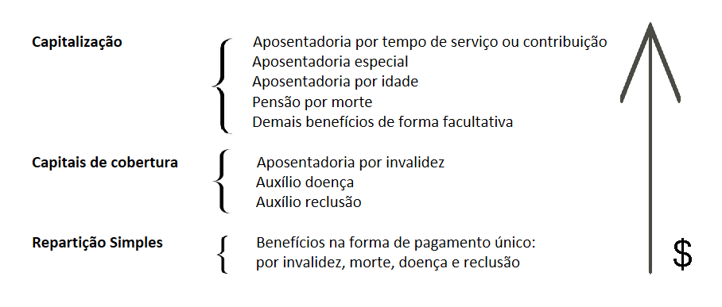

<br> <br>

<head><link rel="preconnect" href="https://fonts.googleapis.com"> <link rel="preconnect" href="https://fonts.gstatic.com" crossorigin> <link href="https://fonts.googleapis.com/css2?family=Amatic+SC:wght@400;700&family=Montserrat:wght@100;400;900&family=Reenie+Beanie&family=Ubuntu:wght@300&display=swap" rel="stylesheet"> <link rel="stylesheet" href="../css/styles.css"></head>

------------------------------------------------------------------------

<div id="hello" class="greeting message" style="color: red;">
  Hello <strong>world</strong>!
</div>

# **Apresentação**

<p class="justify">

              A matemática atuarial é um campo interdisciplinar que combina conceitos de matemática, probabilidade e estatística para analisar e gerenciar riscos financeiros. Ela é aplicada em diversas áreas, como seguros, previdência, investimentos e finanças corporativas, ajudando a avaliar a probabilidade de eventos futuros e seus impactos financeiros. Os atuários utilizam modelos matemáticos para prever a probabilidade de eventos como morte, invalidez ou morbidez, e calcular o valor esperado de pagamentos ou recebimentos futuros. A precisão desses cálculos pode ter um grande impacto nos resultados financeiros das empresas e indivíduos envolvidos. <br>           O presente trabalho visa explorar as principais técnicas e conceitos da matemática atuarial, com foco nos cálculos de seguros e anuidades em suas formas discretas e contínuas. Serão utilizados tanto o pacote lifecontingencies para o software R quanto fórmulas manuais para realizar os cálculos necessários. O relatório apresenta uma análise detalhada das principais fórmulas e conceitos utilizados na matemática atuarial, com exemplos práticos que ilustram sua aplicação.

          É importante enfatizar que ass tábuas de mortalidades são ferramentas essenciais no campo dos seguros, pois fornece informações valiosas sobre a probabilidade de morte em diferentes idades. Ela é uma tabela estatística que descreve a taxa de mortalidade em uma determinada população, levando em consideração fatores como idade, sexo e outros atributos relevantes.

O gráfico abaixo mostra o comportamento que as diferentes tábuas de mortalidade podem apresentar:

```{r Pacotes para personalizar o markdown first, include=FALSE}
library(knitr)
# kable(PhillipsDados)
library(dplyr)
library(car)
library(rstatix)
library(emmeans)
library(ggplot2)
library(kableExtra)
library(htmltools)
library(equatiomatic)
library(gganimate)
library(av)
```

```{r Gráfico animado, echo=FALSE, warning=FALSE}
# GRAFICO PIBR POR GOVERNO ANIMADO 2
dados_tabuas = read.delim('../base_de_dados/banco_de_tabuas.txt',dec = ',', header = T)
# graficopibr<-ggplot(data=dados_tabuas)+
#   geom_line(size=1.2, aes(x= x, y=BR.EMSmt.v.2015.m, color = "#23dedb", name= "BR.EMSmt.v.2015.m"), alpha = 0.5)+
#   geom_line(size=1.2, aes(x= x, y=BR.EMSmt.v.2015.f, color = "#ff6bb0", name= "BR.EMSmt.v.2015.f"), alpha = 0.5)+
#   geom_line(size=1.2, aes(x= x, y=AMERICAN.EXPERIENCE, color = "#fffb00", name= "AMERICAN EXPERIENCE"), alpha = 0.5)+
#   labs(title = "COMPARATIVO TÁBUAS DE MORTALIDADE", x= "Idade em anos",y="qx")+
#   theme_minimal()+
#   theme(axis.title.x= element_text(size=13),
#         axis.title.y=element_text(size=13),
#         axis.text.x=element_text(size=12),
#         axis.text.y = element_text(size=12),
#         plot.title = element_text(size=16, hjust = 0.5),
#         legend.text = element_text(size=12))+
#   transition_reveal(x)+
#   scale_color_manual(values = c("#23dedb", "#ff6bb0", "#fffb00"), name = "",
#                      labels = c("BR.EMSmt.v.2015.m", "BR.EMSmt.v.2015.f", "AMERICAN EXPERIENCE")) +
#   view_follow(fixed_y= TRUE)
# animate(graficopibr, nframes=144, fps=18, width = 900, height=500, end_pause = 70)
```

Ao calcular os prêmios e benefícios dos seguros, as seguradoras utilizam a tábua de mortalidade como base para estimar as probabilidades de ocorrência de eventos, e no presente relatório não foi diferente, para os cálculos dos seguros e anuidades utilizei como ponto de partida a probabilidade de morte *(qx)* da tábua *BR.EMSsb.v.2015.m* que pode ser encontrada no [Banco de tábuas do IBA](https://atuarios.org.br/tabuas-biometricas/).

</p>

```{r site}
knitr::include_url("https://atuarios.org.br/tabuas-biometricas/")
```

<hr class="dotted">

Limpando o console:

```{r Limpando o Console}
rm(list = ls())
```

Retirando a notação ciêntífica:

```{r Retirando a notação científica}
options(scipen = 9999)
options(max.print = 100000)
```

Carreganto os pacotes necessários:

```{r Pacotes utilizados, warning = FALSE, message = FALSE}
if (!require("lifecontingencies")) {
  install.packages("lifecontingencies")
  library("lifecontingencies")
}
```

Base de dados:

```{r Gerando a base de dados, warning=FALSE, message=FALSE}
dados <- read.table("../base_de_dados/bremsmt2015f.txt", header = TRUE)
tv_dados <- probs2lifetable(dados$qx, type = "qx", radix = 10000, name = "bremsmt2015f")
tc_dados <- new("actuarialtable", x = tv_dados@x, lx = tv_dados@lx, name = "Tábua de comutaçao bremsmt2015f", interest = 0.06)
dados_tabuas = read.delim('../base_de_dados/banco_de_tabuas.txt',dec = ',', header = T)
```

```{r Pacotes para personalizar o markdown, include=FALSE}
library(knitr)
# kable(PhillipsDados)
library(dplyr)
library(car)
library(rstatix)
library(emmeans)
library(ggplot2)
library(kableExtra)
library(htmltools)
library(equatiomatic)
library(gganimate)
```

Visualização da base de dados: <br>

```{r class.source="watch-out"}
library(rmarkdown)
tv_dados
#paged_table(as.data.frame(tv_dados))
```

```{r Definição de valores, include=FALSE}
w <- which.max(dados$qx) - 1
w
i <- 0.04
v <- 1 / (1 + i)
x <- 40
m <- 30
n <- 20
d <- log(1 + i)
```

```{r Construção das tábuas utilizando o pacote lifecontigencies, warning=FALSE, message=FALSE}
# Construção da tábua de vida
tv <- probs2lifetable(dados$qx, type = "qx", radix = 1000, name = "Tábua de vida BR-EMS-mt 2015 feminina")

# Construção da tábua de comutação
tc <- new("actuarialtable", x = tv@x, lx = tv@lx, name = "Tábua de comutação BR-EMS-mt 2015 feminina", interest = 0.04)

# Cálculo de seguros
l <- tv@lx
```

<br> <br>

# Leis de mortalidade

<p class="justify">

Leis de mortalidade são expressões matemáticas que descrevem a mortalidade em função da idade e um conjunto de parâmetros. Essas leis não são somente usada na atuária, mas também nas áreas de demografia (projeções de população) e saúde. Alguns dos modelos conhecidos são: Makeham, Gompertz, Thiele, Perks, Heligman-Pollard. E você pode se perguntar qual a finalidade dessas leis, na prática. Bom elas servem principalmente para criação de tábuas de vida específicas para uma massa. PS: No caso de criação de tábuas de vída, o modelo mais utilizado é o de Heligman-Pollard.

</p>

+------------------+------------------------------+---------------------------+--------------------------------+-------------------------------+
| Distribuição     | \\(l_x\\)                    | μ(x)                      | s(x)                           | Restrições                    |
+==================+==============================+===========================+================================+===============================+
| De Moivre (1729) | \\(k \\cdot (\\omega - x)\\) | \\((\\omega - x)\^{-1}\\) | \\(1 - \\frac{x}{\\omega}\\)   | 0 ≤ x \< ω                    |
+------------------+------------------------------+---------------------------+--------------------------------+-------------------------------+
| Gompertz (1825)  | xxx                          | \\(Bc\^x\\)               | \\(\\exp[-m(c\^x - 1)]\\)      | B \> 0, c \> 1, x ≥ 0         |
+------------------+------------------------------+---------------------------+--------------------------------+-------------------------------+
| Makeham (1860)   | xxx                          | \\(A + Bc\^x\\)           | \\(\\exp[-Ax - m(c\^x - 1)]\\) | B \> 0, A ≥ -B, c \> 1, x ≥ 0 |
+------------------+------------------------------+---------------------------+--------------------------------+-------------------------------+
| Weibull (1939)   | xxx                          | \\(kx\^n\\)               | \\(\\exp(-ux\^{n+1})\\)        | k \> 0, n \> 0, x ≥ 0         |
+------------------+------------------------------+---------------------------+--------------------------------+-------------------------------+
| Thiele           | xxx1                         | xxx                       | xxx3                           | xxx                           |
+------------------+------------------------------+---------------------------+--------------------------------+-------------------------------+
| Heligman-Pollard | xxx                          | xxx2                      | xxx                            | xxx                           |
+------------------+------------------------------+---------------------------+--------------------------------+-------------------------------+

# 1. Seguros individuais e discretos

Formulação geral: $$ \boxed{A = \sum {v^{t+1} \cdot _{t\scriptsize{|}}q_x}} \\ _{t\scriptsize{|}}q_x = \frac{l_{x+t}-l_{x+t+1}}{l_x} \\ v^{t+1} \rightarrow \text{é utilizado por conta que normalmente a indenização é paga não no momento da morte (t) e sim em t+1} $$ Dados exercícios seguros individuais e discretos:

```{r dados1}
x = 107
w = 118
n = 2
m = 2
i = 0.05
v <- 1 / (1 + i)
```

## 1.1 Dotal puro de n anos $\boxed{_nE_x}$

Manual 📝:

```{r 1.1}
tpx <- l[x + n + 1] / l[x + 1]
nEx <- (v^n) * (tpx)
nEx
```

Pacote 💻:

```{r 1.1 pacote}
Exn(tc, x=x, n=n, i=i) # OK
```

<hr class="dotted">

## 1.2 De vida inteira $\boxed{A_x}$

Manual 📝:

```{r 1.2}
t <- 0:(w - x)
t.qx <- (l[x + t + 1] - l[x + t + 1 + 1]) / l[x + 1]
t.qx <- c(t.qx[!is.na(t.qx)], rep(0, 1))
Ax <- sum((v^(t + 1)) * t.qx)
Ax
```

Pacote 💻:

```{r 1.2 pacote}
Axn(tc, x=x, i=i) # OK
```

<hr class="dotted">

## 1.3 De vida inteira e diferido de m anos $\boxed{_{m\scriptsize{|}}A_x}$

Manual:

```{r 1.3}
t <- m:(w-x-1)
t.qx <- (l[x + t + 1] - l[x + t + 1 + 1]) / l[x + 1]
t.qx <- c(t.qx[!is.na(t.qx)])

total = 0
for (aux in m:(w-x-1)) {
  parcela <- v^(aux+1)*t.qx[aux-m+1]
  print(paste0("O valor da ", aux, "ª parcela é: ", parcela))
  total = total + parcela
}
print(paste0("O valor total é: ", total))
mAx <- sum((v^(t + 1)) * t.qx)
mAx
```

Pacote 💻:

```{r 1.3 pacote}
Axn(tc, x=x, i=i, m=m) # OK
```

<hr class="dotted">

## 1.4 Temporário de n anos $\boxed{A^{\small{1}}_{x\ :\ n⃧}}$

Manual 📝:

```{r 1.4}
t <- 0:(n-1)
t.qx <- (l[x + t + 1] - l[x + t + 1 + 1]) / l[x + 1]
Axn <- sum((v^(t + 1)) * t.qx)
Axn
```

Pacote 💻:

```{r 1.4 pacote}
Axn(tc, x=x, i=i, n=n) # OK
```

<hr class="dotted">

## 1.5 Temporário de n anos e diferido de m anos $\boxed{_{m\scriptsize{|}}A^{\small{1}}_{x\ :\ n⃧}}$

Manual 📝:

```{r 1.5}
t <- m:(n+m-1)
t.qx <- (l[x + t + 1] - l[x + t + 1 + 1]) / l[x + 1]
Axn <- sum((v^(t + 1)) * t.qx)
Axn
```

Pacote 💻:

```{r 1.5 pacote}
Axn(tc, x=x, i=i, n=n, m=m) # OK
```

<hr class="dotted">

## 1.6 Dotal misto de n anos $\boxed{A_{x\ :\ n⃧}}$

Manual 📝:

```{r 1.6}
t <- 0:(n-1)
t.qx <- (l[x + t + 1] - l[x + t + 1 + 1]) / l[x + 1]
AxnMISTO <- sum((v^(t + 1)) * t.qx)
tpx <- l[x + n + 1] / l[x + 1]
nEx <- (v^n) * (tpx)
AxnMISTO+nEx
```

Pacote 💻:

```{r 1.6 pacote}
AExn(tc, x=x, i=i, n=n) #OK
```

<hr class="dotted">

## 1.7 Dotal misto de n anos e diferido de m anos $\boxed{_{m\scriptsize{|}}A_{x\ :\ n⃧}}$

Manual 📝

```{r 1.7}
t <- m:(n+m-1)
t.qx <- (l[x + t + 1] - l[x + t + 1 + 1]) / l[x + 1]
AxnMISTO <- sum((v^(t + 1)) * t.qx)
tpx <- l[x + n + 1] / l[x + 1]
nEx <- (v^n) * (tpx)
AxnMISTO+nEx
```

Pacote 💻:

```{r 1.7 pacote}
# Não há como checar, essa anuidade é apenas para fins didáticos
```

<hr class="dotted">

# 2. Seguros individuais e contínuos

Formulação geral: $$ \bar{A} = \int{v^t \cdot _{t\scriptsize{|}}q_x \ \ \ dt} $$ $$ v^t \rightarrow \ e^{-\delta t}\\ _{t\scriptsize{|}}q_x \rightarrow \  _tp_x \cdot \mu_{x+t}$$ $$ \boxed {\bar{A} = \int{e^{-\delta t}\cdot _tp_x \cdot \mu_{x+t} \ \ \ dt}} $$ Dados utilizados para o cálculo dos seguros individuais e contínuos:

```{r 2.0 dados}
IS = "?"
x = 30
n = 20
m = 10
i = 0.05
v <- 1 / (1 + i)
delta = log(1+i)
```

## 2.1 Dotal puro de n anos $\boxed{_nE_x}$

```{r 2.1}
tpx <- l[x + n + 1] / l[x + 1]
nEx <- (v^n) * (tpx)
nEx
```

<hr class="dotted">

## 2.2 De vida inteira $\boxed{\bar{A}_x}$

```{r 2.2}
t <- 0:(w - x)
tpx <- function(t) l[x + t + 1] / l[x + 1]
uxt <- function(t) (l[x + t - 1 + 1] - l[x + t + 1 + 1]) / (2 * l[x + t + 1])
ft <- function(t) exp(-d * t) * tpx(t) * uxt(t)
integrate(ft, min(t), max(t), subdivisions = 1000)$value
```

<hr class="dotted">

## 2.3 De vida inteira e diferido de m anos $\boxed{_{m\scriptsize{|}}\bar{A}_x}$

```{r 2.3}
t <- m:(w - x - 1)
tpx <- function(t) l[x + t + 1] / l[x + 1]
uxt <- function(t) (l[x + t - 1 + 1] - l[x + t + 1 + 1]) / (2 * l[x + t + 1])
ft <- function(t) exp(-d * t) * tpx(t) * uxt(t)
integrate(ft, min(t), max(t), subdivisions = 1000)$value
```

<hr class="dotted">

## 2.4 Temporário de n anos $\boxed{\bar{A}^{\small{1}}_{x\ :\ n⃧}}$

```{r 2.4}
t <- 0:(n - 1)
tpx <- function(t) l[x + t + 1] / l[x + 1]
uxt <- function(t) (l[x + t - 1 + 1] - l[x + t + 1 + 1]) / (2 * l[x + t + 1])
ft <- function(t) exp(-d * t) * tpx(t) * uxt(t)
integrate(ft, min(t), max(t), subdivisions = 1000)$value
```

<hr class="dotted">

## 2.5 Temporário de n anos e diferido de m anos $\boxed{_{m\scriptsize{|}}\bar{A}^{\small{1}}_{x\ :\ n⃧}}$

```{r 2.5}
t <- m:(n+m-1)
tpx <- function(t) l[x + t + 1] / l[x + 1]
uxt <- function(t) (l[x + t - 1 + 1] - l[x + t + 1 + 1]) / (2 * l[x + t + 1])
ft <- function(t) exp(-d * t) * tpx(t) * uxt(t)
integrate(ft, min(t), max(t), subdivisions = 1000)$value
```

<hr class="dotted">

## 2.6 Dotal misto de n anos $\boxed{\bar{A}_{x\ :\ n⃧}}$

```{r 2.6}
t <- 0:(n-1)
tpx <- function(t) l[x + t + 1] / l[x + 1]
uxt <- function(t) (l[x + t - 1 + 1] - l[x + t + 1 + 1]) / (2 * l[x + t + 1])
ft <- function(t) exp(-d * t) * tpx(t) * uxt(t)
A1xn <- integrate(ft, min(t), max(t), subdivisions = 1000)$value
tpx <- l[x + n + 1] / l[x + 1]
nEx <- (v^n) * (tpx)
A1xn+nEx
```

<hr class="dotted">

## 2.7 Dotal misto de n anos e diferido de m anos $\boxed{_{m\scriptsize{|}}\bar{A}_{x\ :\ n⃧}}$

```{r 2.7}
t <- m:(n+m-1)
tpx <- function(t) l[x + t + 1] / l[x + 1]
uxt <- function(t) (l[x + t - 1 + 1] - l[x + t + 1 + 1]) / (2 * l[x + t + 1])
ft <- function(t) exp(-d * t) * tpx(t) * uxt(t)
mA1xn <- integrate(ft, min(t), max(t), subdivisions = 1000)$value
tpx <- l[x + n + m + 1] / l[x + 1]
mnEx <- (v^(n+m)) * (tpx)
mA1xn+mnEx
```

<hr class="dotted">

# 3. Anuidades individuais e discretas

## 3.0 Dados utilizados:

```{r dados 3.0}
i <- 0.04
v <- 1 / (1 + i)
x <- 40 # Relembrando os valores
m <- 30
n <- 20
```

## 3.1 Imediata, vitalícia e antecipada $\boxed{{a ̈}_{\small{x}}}$

Manual 📝

```{r 3.1 manual}
t <- 0:(w - x)
t.px <- l[x + t + 1] / l[x + 1]
axna <- sum(v^t * t.px)
axna
```

```{r 3.1 pacote}
axn(tc, x = x)
```

<hr class="dotted">

## 3.2 Imediata, vitalícia e postecipada $\boxed{{a}_{\small{x}}}$

Manual 📝

```{r 3.2 manual}
t <- 1:(w - x)
t.px <- l[x + t + 1] / l[x + 1]
axnb <- sum(v^t * t.px)
axnb
```

Pacote 💻

```{r 3.2 pacote}
axn(tc, x = x, payment = "arrears")
```

<hr class="dotted">

## 3.3 Diferida, vitalícia e antecipada $\boxed{_{\small{m}}{\ddot{a}}_{\small{x}}}$

Manual 📝

```{r 3.3 manual}
t <- m:(w - x)
t.px <- l[x + t + 1] / l[x + 1]
axnc <- sum(v^t * t.px)
axnc
```

Pacote 💻

```{r 3.3 pacote}
axn(tc, x = x, m = m)
```

<hr class="dotted">

## 3.4 Diferida, vitalícia e postecipada $\boxed{_{\small{m}}{{a}}_{\small{x}}}$

Manual 📝

```{r 3.4 manual}
t <- (m + 1):(w - x)
t.px <- l[x + t + 1] / l[x + 1]
axnd <- sum(v^t * t.px)
axnd
```

Pacote 💻

```{r 3.4 pacote}
axn(tc, x = x, m = m, payment = "arrears")
```

<hr class="dotted">

## 3.5 Imediata, temporária e antecipada $\boxed{{\ddot{a}}_{\small{x\ :\ n⃧}}}$

Manual 📝

```{r 3.5 manual}
t <- 0:(n - 1)
t.px <- l[x + t + 1] / l[x + 1]
axne <- sum(v^t * t.px)
axne

```

Pacote

```{r 3.5 pacote}
axn(tc, x = x, n = n)
```

<hr class="dotted">

## 3.6 Imediata, temporário e postecipada $\boxed{{{a}}_{\small{x\ :\ n⃧}}}$

Manual 📝

```{r 3.6 manual}
t <- 1:(n)
t.px <- l[x + t + 1] / l[x + 1]
axne <- sum(v^t * t.px)
axne
```

Pacote 💻

```{r 3.6 pacote}
axn(tc, x = x, n = n, payment = "arrears")
```

<hr class="dotted">

## 3.7 Diferida, temporária e antecipada $\boxed{{_{\small{m}}\ddot{a}}_{\small{x\ :\ n⃧}}}$

Manual 📝

```{r 3.7 manual}
t <- m:(m + n - 1)
t.px <- l[x + t + 1] / l[x + 1]
axne <- sum(v^t * t.px)
axne
```

Pacote 💻

```{r 3.7 pacote}
axn(tc, x = x, m = m, n = n)
```

<hr class="dotted">

## 3.8 Diferida, temporária e postecipada $\boxed{{_{\small{m}}{a}}_{\small{x\ :\ n⃧}}}$

Manual 📝

```{r 3.8 manual}
t <- (m + 1):(m + n - 1)
t.px <- l[x + t + 1] / l[x + 1]
axnh <- sum(v^t * t.px)
axnh
```

Pacote 💻

```{r 3.8 pacote}
axn(tc, x = x, m = m, n = n, payment = "arrears")
```

<hr class="dotted">

# 4. Anuidades individuais e contínuas

## 4.0 Dados utilizados:

```{r 4.0 dados}
IS <- 1
i <- 0.04
v <- 1 / (1 + i)
x <- 30 # Relembrando os valores
m <- 20
n <- 20
d <- 0.06
u <- 0.04
w <- 100
```

## 4.1 Imediata e vitalícia $\boxed{{\bar{a}}_{\small{x}}}$

```{r 4.1}
t <- 0:(w - x)
tpx <- function(t) exp(-u*t)
ft <- function(t) IS*exp(-d * t) * tpx(t)
integrate(ft, min(t), max(t), subdivisions = 1000)$value
```

<hr class="dotted">

## 4.2 Imediata e Temporária $\boxed{{\bar{a}}_{\small{x\ :\ n⃧}}}$

```{r 4.2}
t <- 0:(n)
tpx <- function(t) exp(-u*t)
ft <- function(t) IS*exp(-d * t) * tpx(t)
integrate(ft, min(t), max(t), subdivisions = 1000)$value
```

<hr class="dotted">

## 4.3 Diferida e Vitalícia $\boxed{_{\small{m}}{{\bar{a}}}_{\small{x}}}$

```{r 4.3}
t <- m:(w-x)
tpx <- function(t) exp(-u*t)
ft <- function(t) IS*exp(-d * t) * tpx(t)
integrate(ft, min(t), max(t), subdivisions = 1000)$value
```

<hr class="dotted">

## 4.4 Diferida e Temporária $\boxed{_{\small{m}}{{\bar{a}}}_{\small{x\ :\ n⃧}}}$

```{r 4.4}
t <- m:(m+n)
tpx <- function(t) exp(-u*t)
ft <- function(t) IS*exp(-d * t) * tpx(t)
integrate(ft, min(t), max(t), subdivisions = 1000)$value
```

<hr class="dotted">

# 5. Seguro para múltiplas vidas

# 5.0 Dados Utilizados

```{r 5.0 Dados Utilizados}
x = 31 # Thiago (coloquei 31 para facilitar os cálculos)
y = 26 # Fernanda (Coloquei 26 para facilitar os cálculos)
z = 6 # Cauê (Coloquei 6 para facilitar os cálculos)
i = 0.04
v = 1/(1+i)
n = 10
m = 30
w = 119
```

## 5.1.1 Dotal puro de n anos (vida conjunta) $\boxed{_nE_{xy}}$

Manual 📝

```{r 5.1.1 manual}
tpxy <- l[x + n + 1] / l[x + 1] * l[y + n + 1] / l[y + 1]
nExy <- v^n * tpxy
nExy
```

Pacote 💻

```{r 5.1.1 pacote}
listOfTables = list(tv, tv)
v^n * pxyzt(listOfTables, x = c(x, y), t = n, status = "joint")
```

<hr class="dotted">

## 5.1.2 Dotal puro de n anos (ultimo sobrevivente) $\boxed{_nE_{{\overline{xy}}}}$

Manual 📝

```{r 5.1.2 manual}

```

Pacote 💻

```{r 5.1.2 pacote}

```

<hr class="dotted">

## 5.2.1 De vida inteira (vida conjunta) $\boxed{A_{xy}}$

Manual 📝

```{r 5.2.1 manual}

t <- 0:(w-x-1)#;t
produto=sum(v^(t+1)*(l[x+t]*l[y+t]-l[x+t+1]*l[y+t+1])/(l[x]*l[y]));produto
```

Pacote 💻

```{r 5.2.1 pacote}
listOfTables = list(tv, tv)
Axyzn = Axyzn(listOfTables, x=c(30, 25), i= i, status = "joint");
Axyzn
```

<hr class="dotted">

## 5.2.2 De vida inteira (último sobrevivente) $\boxed{A_{\overline{xy}}}$

Manual 📝

```{r 5.2.2 manual}
total = 0
for (aux in 0:(w-y)) {
  if (!is.na(l[x+aux]/l[x])) {
  p1 <- l[x+aux]/l[x]
} else {
  p1 <- 0
}
  if (!is.na(l[y+aux]/l[y])) {
  p2 <- l[y+aux]/l[y]
} else {
  p2 <- 0
}
  if (!is.na(l[x+aux+1]/l[x])) {
  p3 <- l[x+aux+1]/l[x]
} else {
  p3 <- 0
}
  if (!is.na(l[y+aux+1]/l[y])) {
  p4 <- l[y+aux+1]/l[y]
} else {
  p4 <- 0
}
  parcela <- v^(aux+1)*((p1+p2-p1*p2)-(p3+p4-p3*p4));
  #print(paste0("O valor da ", aux, " parcela é: ", parcela))
  total = total + parcela
}
produto = total
print(paste0("O valor total é: ", total))
```

Pacote 💻

```{r 5.2.2 pacote}
listOfTables = list(tv, tv)
Axyzn = Axyzn(listOfTables, x=c(30, 25), i= 0.04,status = "last");
Axyzn
```

<hr class="dotted">

## 5.3.1 De vida inteira e diferido de m anos $\boxed{_{m\scriptsize{|}}A_{xy}}$

Manual 📝

```{r 5.3.1 manual}

t <- m:(w-x-1)#;t
produto=sum(v^(t+1)*(l[x+t]*l[y+t]-l[x+t+1]*l[y+t+1])/(l[x]*l[y]));produto
```

Pacote 💻

```{r 5.3.1 pacote}
listOfTables = list(tv, tv)
Axyzn = Axyzn(listOfTables, x=c(30, 25), i= 0.04, m = m, status = "joint");
Axyzn
```

<hr class="dotted">

## 5.3.2 De vida inteira e diferido de m anos $\boxed{_{m\scriptsize{|}}A_{\overline{xy}}}$

Manual 📝 Pacote 💻

<hr class="dotted">

## 5.4.1 Temporário de n anos $\boxed{A^{\small{1}}_{{xy}\ :\ n⃧}}$

Manual 📝 Pacote 💻

<hr class="dotted">

## 5.4.2 Temporário de n anos $\boxed{A^{\small{1}}_{{\overline{xy}}\ :\ n⃧}}$

Manual 📝 Pacote 💻

<hr class="dotted">

## 5.5.1 Temporário de n anos e diferido de m anos $\boxed{_{m\scriptsize{|}}A^{\small{1}}_{{xy}\ :\ n⃧}}$

Manual 📝 Pacote 💻

<hr class="dotted">

## 5.5.2 Temporário de n anos e diferido de m anos $\boxed{_{m\scriptsize{|}}A^{\small{1}}_{{\overline{xy}}\ :\ n⃧}}$

Manual 📝 Pacote 💻

<hr class="dotted">

## 5.6.1 Dotal misto de n anos $\boxed{A_{{xy}\ :\ n⃧}}$

Manual 📝 Pacote 💻

<hr class="dotted">

## 5.6.2 Dotal misto de n anos $\boxed{A_{{\overline{xy}}\ :\ n⃧}}$

Manual 📝 Pacote 💻

<hr class="dotted">

## 5.7.1 Dotal misto de n anos e diferido de m anos $\boxed{_{m\scriptsize{|}}A_{{xy}\ :\ n⃧}}$

Manual 📝 Pacote 💻

<hr class="dotted">

## 5.7.2 Dotal misto de n anos e diferido de m anos $\boxed{_{m\scriptsize{|}}A_{{\overline{xy}}\ :\ n⃧}}$

Manual 📝 Pacote 💻

<hr class="dotted">

# 6. Anuidades para múltiplas vidas

# 7. Anuidades reversíveis

$a_{x|y}\rightarrow \text{caso x faleça, a renda é revertida para y}$ morte de x -\> inicio da reversão morte de y -\> fim da reversão

## 7.0 Dados utilizados:

```{r 7.0 dados}

```

## 7.1 $\boxed{_nE_{xy}}$

# 4. Regimes Financeiros

<p class="justify">

Os regimes financeiros referem-se à forma como as contribuições são acumuladas e como os benefícios são pagos ao longo do tempo. Existem três principais regimes financeiros:

</p>



## Regime de Repartição Simples (PAYG - Pay-As-You-Go)

<p class="justify">

Neste regime as contribuições dos participantes ativos são usadas para pagar os benefícios dos aposentados atuais, sem acumulação de fundos, de modo que as receitas e despesas devem se equilibrar anualmente. Este regime é comum em sistemas públicos de previdência social.

</p>

## Regime de Capitalização

<p class="justify">

Neste regime as contribuições dos participantes são acumuladas e investidas para gerar um fundo que será usado para pagar os benefícios futuros, acumulando reservas financeiras ao longo do tempo, sendo típico em planos de previdência privada.

</p>

## Regime de Repartição de Capitais de Cobertura

<p class="justify">

Esse regime combina características dos regimes de repartição simples e capitalização, acumulando um fundo para garantir a solvência a curto e médio prazo, mas não necessariamente para a totalidade dos benefícios futuros

</p>

# Referências

-   BOWERS, N. L. et al. Actuarial mathematics. The Society of Actuaries, 1997.
-   CORDEIRO FILHO, Antonio. Cálculo Atuarial Aplicado. 2. ed. São Paulo: Atlas, 2014
-   FinancialandActuarialMathematicsforLifeContingencies [[PDF](https://cran.r-project.org/web/packages/lifecontingencies/lifecontingencies.pdf)].
-   Fernanda Peres: Rmarkdown. [Canal do Youtube](https://www.youtube.com/c/FernandaPeres).

<!-- ```{js, echo=FALSE} -->
<!-- (function() { -->
<!--   var codes = document.querySelectorAll('pre:not([class])'); -->
<!--   var code, i, d, s, p; -->
<!--   for (i = 0; i < codes.length; i++) { -->
<!--     code = codes[i]; -->
<!--     p = code.parentNode; -->
<!--     d = document.createElement('details'); -->
<!--     s = document.createElement('summary'); -->
<!--     s.innerText = 'Details'; -->
<!--     // <details><summary>Details</summary></details> -->
<!--     d.appendChild(s); -->
<!--     // move the code into <details> -->
<!--     p.replaceChild(d, code); -->
<!--     d.appendChild(code); -->
<!--   } -->
<!-- })(); -->
<!-- ``` -->
